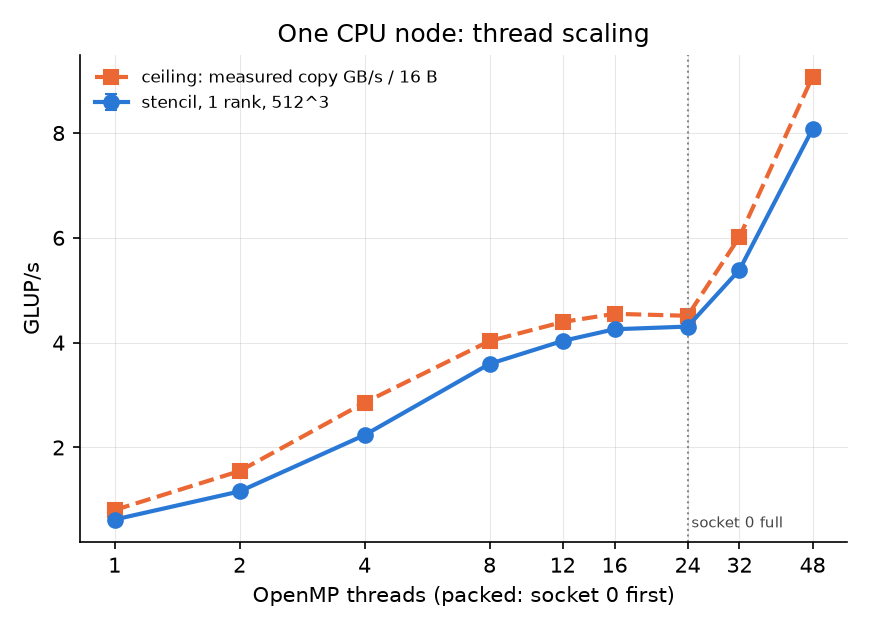
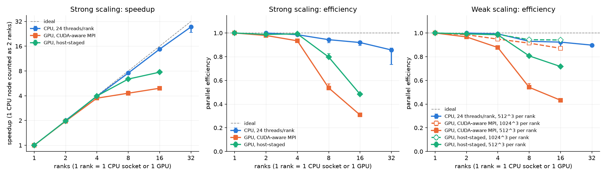
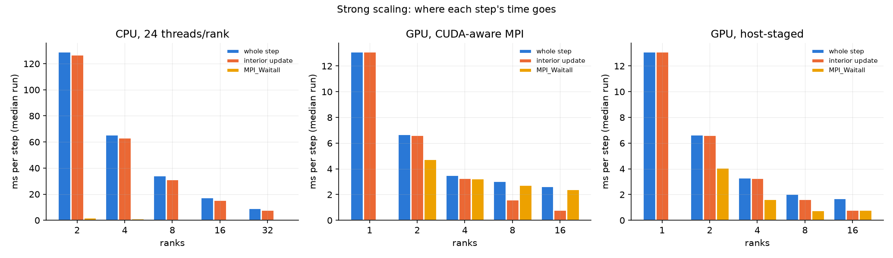
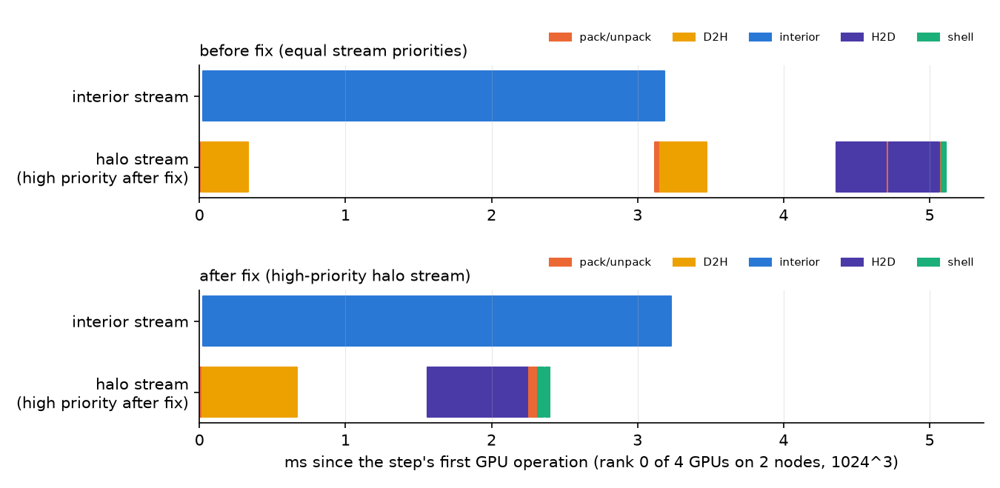
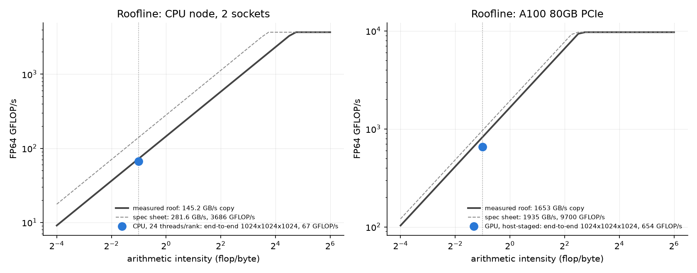

# halo3d

A 3D heat-diffusion solver (explicit 7-point Jacobi stencil) in C++17 that combines **MPI + OpenMP + CUDA**:
a 3D Cartesian domain decomposition, non-blocking halo exchange overlapped with interior compute, and two
backends picked at run time (`--backend omp | cuda`). The solver is about 510 lines of C++/CUDA, uses no
frameworks, and checks itself against an exact solution on every run.

Every measurement in this README was taken on a national HPC system (CPU nodes: 2x 24-core Xeon; GPU nodes:
2x A100 80GB PCIe; InfiniBand HDR100) and comes from a CSV in [`results/`](results/). Each point was run 3
times; tables show the median and the min-max spread.

**Headline numbers** (details and caveats below)

| what | result |
|---|---|
| correctness | all 390 runs (1 to 32 ranks, both backends, before and after the fixes) PASS against the exact discrete solution: rel. L2 error 4.5e-16 to 2.1e-14 |
| one CPU node (2x 24 cores), 1024^3 | 8.30 GLUP/s = 92% of the measured STREAM-copy ceiling (5.38 GLUP/s before the y-blocking fix) |
| CPU strong scaling, 1024^3, 1 -> 16 nodes | 8.30 -> 113.7 GLUP/s: speedup 13.7, efficiency 86% |
| CPU weak scaling, 512^3 per rank, 1 -> 16 nodes | 90% efficiency (8.43 -> 121.1 GLUP/s) |
| one A100 80GB PCIe, 1024^3 | 81.8 GLUP/s; interior kernel 1309 GB/s = 79% of the measured 1653 GB/s copy bandwidth |
| GPU strong scaling, 1024^3, 1 -> 16 GPUs | 81.8 -> 632 GLUP/s: 99% efficiency on 4 GPUs (2 nodes), 80% on 8, 48% on 16 |
| GPU weak scaling, 1 -> 16 GPUs | 512^3 per GPU: 72% (928 GLUP/s). 1024^3 per GPU: 94% (1227 GLUP/s) |
| two performance bugs found by measuring | CPU: layer condition violated (fixed: +54% per node). GPU: halo kernels starved behind the interior kernel (fixed: 4 GPUs 65% -> 99% strong-scaling efficiency) |

## Problem

We solve `u_t = alpha * lap(u)` on a box with `u = 0` on the walls. The update is explicit Euler on a
uniform grid, with diffusion number `r = alpha*dt/h^2 = 1/8` (stable because `r <= 1/6`):

```
v[i,j,k] = (1 - 6r) u[i,j,k] + r (u[i±1,j,k] + u[i,j±1,k] + u[i,j,k±1])      double precision
```

**Verification.** The initial condition is the slowest sine mode,
`u0 = sin(pi x/(Nx+1)) sin(pi y/(Ny+1)) sin(pi z/(Nz+1))`. That mode is an eigenvector of the discrete
operator, so after `S` steps the exact discrete solution is `G^S u0`, with
`G = 1 - 4r * sum_d sin^2(pi / (2(N_d+1)))`. Each run prints the relative L2 error against that solution.
Any value above round-off (the tolerance is `1e-9`) means a real bug: a wrong face, a wrong neighbour, a
race, or a missed cell. The exit code is non-zero in that case. For reference, each run also prints the
error against the continuous PDE (`exp(-r S pi^2 sum_d 1/(N_d+1)^2)`), which is the expected
`O(h^2 + dt)` discretisation error.

## Design

```
 MPI_Cart_create(px, py, pz), non-periodic; MPI_Dims_create picks the shape, with the most cuts along z
 because z faces are contiguous planes. Each rank owns an (nx+2)(ny+2)(nz+2) block (x fastest) with a
 1-cell ghost layer. Walls are MPI_PROC_NULL neighbours whose ghosts stay 0 (the Dirichlet condition).

 one time step                                     u = current, v = next
 ┌───────────────── halo path ──────────────────┐ ┌──────────── compute path ─────────────┐
 │ pack faces that have a neighbour             │ │ interior update: every cell whose      │
 │   (CUDA kernel | OpenMP loop)                │ │ stencil reads no ghost in flight       │
 │ [D2H to pinned host, unless --cuda-aware]    │ │ (a side with no neighbour counts as    │
 │ MPI_Irecv x6 + MPI_Isend x6, MPI_Waitall     │ │  interior: its ghost is a fixed 0)     │
 │ [H2D] unpack into the ghost layers           │ │                                        │
 │ boundary shell: <= 6 slabs (z, then y, x)    │ │ ...runs while the messages fly...      │
 └──────────────────────────────────────────────┘ └────────────────────────────────────────┘
                     sync, swap(u, v)        -> t_step ~ max(t_interior, t_halo) + t_shell
```

- **OpenMP backend** (`src/stencil_omp.cpp`): the update is **blocked in y**. Each thread marches up z through
  a block of rows sized so that three z-planes of the block fit in half of a core's L2 (`HALO3D_BLOCK_KB`,
  default 512 KB; 21 rows when `nx = 1024`). Then the k-1 and k+1 neighbours are still in cache when they
  are needed, which is the 3-plane "layer condition". `collapse(2)` over (y-block, z) with `schedule(static)`
  and an `omp simd` inner x loop. Arrays are first touched with the same static split, so pages land on the
  socket of the thread that streams them. Faces are packed with OpenMP loops. On a CPU, the overlap only
  happens if the MPI library progresses messages during compute; the printed `halo wait` shows whether it does.
- **CUDA backend** (`src/stencil_cuda.cu`): one rank per GPU, chosen by node-local rank
  (`MPI_Comm_split_type`). The interior uses a 2.5D-blocked kernel: a 32x8 thread tile marches 32 z-planes,
  keeps the z neighbours in registers and reads the x/y neighbours from a shared-memory tile with a halo,
  so each cell is read from DRAM about once. The interior runs on a low-priority stream. A
  **high-priority** second stream packs all faces, stages them through pinned host buffers (the default) or
  hands device pointers to MPI (`--cuda-aware`), unpacks them, and updates the thin shell slabs with a
  one-thread-per-cell kernel. The priority is what keeps the halo path from waiting behind the interior
  kernel's blocks (see "Bugs found"). `cudaEvent`s time the interior kernel alone; `MPI_Wtime` times the loop.
- `src/halo.cpp` holds the grid setup, the interior and shell boxes, and the 6-face `Isend/Irecv`. A
  7-point stencil needs faces only: no edges, no corners.
- `src/bw_cpu.cpp`, `src/bw_gpu.cu`: STREAM-style copy bandwidth, used as the measured roofline roof.

## Hardware and software

| | CPU nodes | GPU nodes |
|---|---|---|
| CPU | 2x Intel Xeon Gold 6240R (Cascade Lake), 24 cores each, 2.4 GHz base, 1 thread per core | same |
| caches | L2 1 MB per core, L3 35.75 MB per socket | same |
| memory | 192 GB, 2 NUMA domains (one per socket) | 192 GB |
| GPU | none | 2x NVIDIA A100 80GB PCIe (sm_80), PCIe Gen3 x16 to the host, no NVLink |
| topology | | both GPUs on socket 0; the InfiniBand NIC on socket 1 (`nvidia-smi topo -m`: GPU-NIC = SYS) |
| network | InfiniBand (adapter not inspected on these nodes) | InfiniBand HDR100: Mellanox ConnectX-6, 100 Gb/s, one per node |

Software: Rocky Linux 9.6, GCC 11.5.0 (`-O3 -march=native -fopenmp`), NVIDIA HPC SDK 25.11 with nvcc 13.0
and HPC-X 2.25.1 (Open MPI 4.1.9, UCX 1.20, built with CUDA support), driver 590.48. The MPI wrapper is pointed
at GCC (`OMPI_CXX=g++`, see `scripts/env.sh`).

Placement: CPU runs use one rank per socket (`--map-by ppr:1:socket:PE=24 --bind-to core`, threads with
`OMP_PLACES=cores OMP_PROC_BIND=close`); GPU runs use one rank per GPU with 12 cores of socket 0 each
(`--map-by ppr:2:node:PE=12`). Nodes were allocated exclusively. Bindings are printed in `results/logs/`.

## Performance model and measured roofs

Each lattice update (LUP) does 8 flops and ideally moves 16 bytes (read `u` once, write `v` once). That gives
an arithmetic intensity of **0.5 flop/byte**, so the kernel is memory-bound on both devices, and the ceiling
is `GLUP/s <= copy bandwidth / 16 B`. A CPU without streaming stores also pays a write-allocate read, but
STREAM's copy counts bytes the same way (16 B per element), so measured copy GB/s / 16 is the matching ceiling.

| device | spec-sheet DRAM bandwidth | measured copy bandwidth | ceiling | best measured | % of ceiling |
|---|---|---|---|---|---|
| one CPU socket (24 threads) | 140.8 GB/s (6x DDR4-2933, the CPU's maximum) | 72.2 GB/s (`bw_cpu`) | 4.51 GLUP/s | 4.31 GLUP/s (512^3) | 95% |
| one CPU node (48 threads) | 281.6 GB/s | 145.2 GB/s | 9.08 GLUP/s | 8.49 GLUP/s (1024^3, 1 rank x 48 threads) | 94% |
| one A100 80GB PCIe | 1935 GB/s | 1653 GB/s copy kernel, 1715 GB/s `cudaMemcpy` D2D | 103 GLUP/s | 81.8 GLUP/s (1024^3) | 79% |

Spec-sheet numbers are ceilings from vendor documents (the installed DIMM speed was not verified); the
measured columns come from `results/cpu_bw.csv` and `results/gpu_bw.csv`. The ridge points (peak FP64 /
measured bandwidth) are about 25 flop/byte for the CPU node (3.7 TFLOP/s nominal at base clock) and about 6
flop/byte for the A100 (9.7 TFLOP/s), so at 0.5 flop/byte only bandwidth matters. See `results/roofline.png`.

Halo cost in time, per rank and step: the interior streams `16 n^3` bytes from DRAM; each face sends `8 n^2`
bytes. For a GPU the halo path is limited by PCIe Gen3 (12-13 GB/s pinned, `results/gpu_bw.csv`) and the
NIC (12.1 GB/s host-to-host between nodes, `results/osu_bw.csv`), both about 130x slower than HBM. So at
`n = 512` the halo takes about as long as the interior update, and hiding it behind the interior is what
decides the scaling.

## Results

### Correctness

`make check` prints PASS (4.4e-15). `scripts/slurm_check.sh` runs 24 cases: the OpenMP backend on 2, 8 and 12
ranks (n = 16, 17, 23, so x, y and z faces and uneven splits are all exercised) and the CUDA backend on 1, 2 and
4 GPUs (4 = two nodes) with n = 16, 17, 64, host-staged and CUDA-aware, plus weak-scaling runs. All PASS, with
errors identical between backends (`results/check.csv`). Every timed run below also verifies itself: 390 runs
in total, none above 2.1e-14.

### One CPU node

Thread scaling, one rank, 512^3, threads packed onto socket 0 first, against the STREAM-style copy bandwidth
measured with the same thread count and binding (`results/cpu_threads.csv`, `results/cpu_bw.csv`,
`results/threads.png`):

| threads | runs | ms/step median (min-max) | GLUP/s | speedup | copy GB/s (same threads) | % of copy ceiling |
|---|---|---|---|---|---|---|
| 1 | 3 | 215.0 (211.3-218.4) | 0.62 | 1.00 | 12.9 | 77% |
| 2 | 3 | 115.5 (115.5-115.9) | 1.16 | 1.86 | 24.8 | 75% |
| 4 | 3 | 60.0 (59.9-60.1) | 2.24 | 3.58 | 45.7 | 78% |
| 8 | 3 | 37.3 (37.2-37.4) | 3.59 | 5.76 | 64.5 | 89% |
| 12 | 3 | 33.3 (33.2-33.3) | 4.03 | 6.46 | 70.3 | 92% |
| 16 | 3 | 31.5 (31.5-31.6) | 4.26 | 6.82 | 72.8 | 94% |
| 24 | 3 | 31.2 (31.1-31.2) | 4.31 | 6.90 | 72.2 | 95% |
| 32 | 3 | 24.9 (24.9-24.9) | 5.39 | 8.63 | 96.3 | 90% |
| 48 | 3 | 16.6 (16.6-16.6) | 8.08 | 12.94 | 145.2 | 89% |

MPI ranks x OpenMP threads on the full node (`results/cpu_hybrid.csv`); the ceiling is 145.2 GB/s / 16 B:

| global grid | ranks x threads | runs | ms/step median (min-max) | GLUP/s | % of copy ceiling | wait ms/step |
|---|---|---|---|---|---|---|
| 1024x1024x1024 | 1 x 48 | 3 | 126.5 (126.2-126.9) | 8.49 | 94% | 0.00 |
| 1024x1024x1024 | 2 x 24 | 3 | 129.1 (128.9-129.2) | 8.31 | 92% | 1.99 |
| 1024x1024x1024 | 4 x 12 | 3 | 129.3 (129.2-130.4) | 8.30 | 91% | 3.99 |
| 1024x1024x1024 | 8 x 6 | 3 | 133.0 (132.8-133.1) | 8.07 | 89% | 3.49 |
| 1024x1024x1024 | 48 x 1 | 3 | 140.9 (140.9-141.0) | 7.62 | 84% | 17.27 |
| 512x512x512 | 1 x 48 | 3 | 16.6 (16.6-16.6) | 8.09 | 89% | 0.00 |
| 512x512x512 | 2 x 24 | 3 | 16.2 (16.2-16.3) | 8.27 | 91% | 0.51 |
| 512x512x512 | 4 x 12 | 3 | 16.6 (16.4-16.8) | 8.10 | 89% | 1.02 |
| 512x512x512 | 8 x 6 | 3 | 17.5 (17.5-19.7) | 7.68 | 85% | 0.91 |
| 512x512x512 | 48 x 1 | 3 | 19.1 (19.1-19.2) | 7.01 | 77% | 4.46 |

Size of the y-blocks (`results/cpu_block_*kb.csv`). Without blocking the node does 5.28 GLUP/s; the optimum is at
three planes of a block in 512 KB, half of the 1 MB L2, as the cache model predicts:

| HALO3D_BLOCK_KB | rows per block (nx = 1024) | runs | ms/step median (min-max) | GLUP/s |
|---|---|---|---|---|
| 0 (off) | whole plane | 3 | 203.3 (203.1-204.2) | 5.28 |
| 128 | 5 | 3 | 141.9 (141.6-142.6) | 7.56 |
| 256 | 10 | 3 | 133.5 (133.3-133.5) | 8.04 |
| 512 | 21 | 3 | 129.2 (128.9-130.2) | 8.31 |
| 1024 | 42 | 3 | 135.2 (135.1-135.4) | 7.94 |
| 4096 | 170 | 3 | 196.4 (196.2-196.4) | 5.47 |



### Strong and weak scaling

One rank = one CPU socket (24 threads) or one GPU. CPU: 2 ranks per node, 1 to 16 nodes. GPU: 2 GPUs per node,
1 to 8 nodes. "wait" is time blocked in `MPI_Waitall`; "interior" is the interior update (CPU: wall time of
the sweep; GPU: the kernel, from `cudaEvent`s). On the GPU the host waits *while* the interior kernel runs, so
the two overlap; the time the overlap did not hide is `step - interior`.

| series | nodes | ranks | global grid | runs | ms/step median (min-max) | GLUP/s | speedup vs first row | efficiency | wait ms/step | interior ms/step | max rel. error |
|---|---|---|---|---|---|---|---|---|---|---|---|
| CPU, 24 threads/rank | 1 | 2 | 1024x1024x1024 | 3 | 129.41 (129.13-129.70) | 8.30 | 1.00 | 1.00 | 1.94 | 126.96 | 1.1e-14 |
| CPU, 24 threads/rank | 2 | 4 | 1024x1024x1024 | 3 | 65.64 (65.00-65.89) | 16.36 | 1.97 | 0.99 | 1.50 | 63.50 | 1.1e-14 |
| CPU, 24 threads/rank | 4 | 8 | 1024x1024x1024 | 3 | 34.29 (34.20-35.24) | 31.32 | 3.77 | 0.94 | 1.19 | 31.30 | 1.1e-14 |
| CPU, 24 threads/rank | 8 | 16 | 1024x1024x1024 | 3 | 17.59 (17.56-18.10) | 61.04 | 7.36 | 0.92 | 1.08 | 15.63 | 1.1e-14 |
| CPU, 24 threads/rank | 16 | 32 | 1024x1024x1024 | 3 | 9.44 (9.26-11.03) | 113.74 | 13.71 | 0.86 | 1.16 | 7.93 | 1.1e-14 |
| GPU, CUDA-aware MPI | 1 | 1 | 1024x1024x1024 | 3 | 13.14 (13.13-13.14) | 81.74 | 1.00 | 1.00 | 0.00 | 13.13 | 2.1e-14 |
| GPU, CUDA-aware MPI | 1 | 2 | 1024x1024x1024 | 3 | 6.71 (6.70-6.71) | 160.06 | 1.96 | 0.98 | 4.77 | 6.65 | 2.1e-14 |
| GPU, CUDA-aware MPI | 2 | 4 | 1024x1024x1024 | 3 | 3.52 (3.51-3.52) | 305.40 | 3.74 | 0.93 | 3.25 | 3.29 | 2.1e-14 |
| GPU, CUDA-aware MPI | 4 | 8 | 1024x1024x1024 | 3 | 3.06 (2.88-3.06) | 350.88 | 4.29 | 0.54 | 2.77 | 1.62 | 2.1e-14 |
| GPU, CUDA-aware MPI | 8 | 16 | 1024x1024x1024 | 3 | 2.66 (2.63-2.67) | 403.20 | 4.93 | 0.31 | 2.43 | 0.81 | 2.1e-14 |
| GPU, host-staged | 1 | 1 | 1024x1024x1024 | 3 | 13.13 (13.13-13.13) | 81.76 | 1.00 | 1.00 | 0.00 | 13.12 | 2.1e-14 |
| GPU, host-staged | 1 | 2 | 1024x1024x1024 | 3 | 6.65 (6.64-6.65) | 161.54 | 1.98 | 0.99 | 4.08 | 6.63 | 2.1e-14 |
| GPU, host-staged | 2 | 4 | 1024x1024x1024 | 3 | 3.31 (3.31-3.31) | 324.62 | 3.97 | 0.99 | 1.66 | 3.29 | 2.1e-14 |
| GPU, host-staged | 4 | 8 | 1024x1024x1024 | 3 | 2.06 (1.99-2.06) | 521.24 | 6.38 | 0.80 | 0.77 | 1.63 | 2.1e-14 |
| GPU, host-staged | 8 | 16 | 1024x1024x1024 | 3 | 1.70 (1.70-1.70) | 632.20 | 7.73 | 0.48 | 0.81 | 0.81 | 2.1e-14 |

| series | nodes | ranks | global grid | runs | ms/step median (min-max) | GLUP/s | efficiency | wait ms/step | interior ms/step | max rel. error |
|---|---|---|---|---|---|---|---|---|---|---|
| CPU, 24 threads/rank, 512^3 per rank | 1 | 2 | 512x512x1024 | 3 | 31.83 (31.83-31.92) | 8.43 | 1.00 | 0.54 | 31.16 | 5.6e-15 |
| CPU, 24 threads/rank, 512^3 per rank | 2 | 4 | 512x1024x1024 | 3 | 32.06 (32.05-32.14) | 16.75 | 0.99 | 0.57 | 31.18 | 8.1e-15 |
| CPU, 24 threads/rank, 512^3 per rank | 4 | 8 | 1024x1024x1024 | 3 | 34.23 (34.22-34.23) | 31.37 | 0.93 | 1.16 | 31.24 | 1.1e-14 |
| CPU, 24 threads/rank, 512^3 per rank | 8 | 16 | 1024x1024x2048 | 3 | 34.49 (34.40-36.24) | 62.26 | 0.92 | 1.49 | 31.36 | 2.6e-15 |
| CPU, 24 threads/rank, 512^3 per rank | 16 | 32 | 1024x2048x2048 | 3 | 35.46 (35.09-35.67) | 121.11 | 0.90 | 2.37 | 31.50 | 5.4e-15 |
| GPU, CUDA-aware MPI, 1024^3 per rank | 1 | 1 | 1024x1024x1024 | 3 | 13.19 (13.16-13.20) | 81.40 | 1.00 | 0.00 | 13.18 | 1.1e-14 |
| GPU, CUDA-aware MPI, 1024^3 per rank | 1 | 2 | 1024x1024x2048 | 3 | 13.38 (13.37-13.38) | 160.48 | 0.99 | 3.76 | 13.26 | 2.6e-15 |
| GPU, CUDA-aware MPI, 1024^3 per rank | 2 | 4 | 1024x2048x2048 | 3 | 13.91 (13.90-13.92) | 308.80 | 0.95 | 8.95 | 13.45 | 5.4e-15 |
| GPU, CUDA-aware MPI, 1024^3 per rank | 4 | 8 | 2048x2048x2048 | 3 | 14.42 (14.42-14.44) | 595.61 | 0.91 | 12.95 | 13.90 | 1.3e-14 |
| GPU, CUDA-aware MPI, 1024^3 per rank | 8 | 16 | 2048x2048x4096 | 3 | 15.14 (14.93-15.17) | 1134.68 | 0.87 | 14.08 | 13.57 | 6.1e-15 |
| GPU, CUDA-aware MPI, 512^3 per rank | 1 | 1 | 512x512x512 | 3 | 1.66 (1.66-1.66) | 80.98 | 1.00 | 0.00 | 1.65 | 6.1e-15 |
| GPU, CUDA-aware MPI, 512^3 per rank | 1 | 2 | 512x512x1024 | 3 | 1.71 (1.71-1.72) | 156.62 | 0.97 | 1.06 | 1.66 | 1.1e-14 |
| GPU, CUDA-aware MPI, 512^3 per rank | 2 | 4 | 512x1024x1024 | 3 | 1.89 (1.89-1.89) | 284.27 | 0.88 | 1.70 | 1.67 | 1.6e-14 |
| GPU, CUDA-aware MPI, 512^3 per rank | 4 | 8 | 1024x1024x1024 | 3 | 3.06 (2.89-3.06) | 350.95 | 0.54 | 2.77 | 1.62 | 2.1e-14 |
| GPU, CUDA-aware MPI, 512^3 per rank | 8 | 16 | 1024x1024x2048 | 3 | 3.83 (3.83-3.85) | 560.79 | 0.43 | 3.53 | 1.62 | 5.3e-15 |
| GPU, host-staged, 1024^3 per rank | 1 | 1 | 1024x1024x1024 | 3 | 13.17 (13.16-13.18) | 81.50 | 1.00 | 0.00 | 13.17 | 1.1e-14 |
| GPU, host-staged, 1024^3 per rank | 1 | 2 | 1024x1024x2048 | 3 | 13.27 (13.26-13.30) | 161.83 | 0.99 | 4.39 | 13.25 | 2.6e-15 |
| GPU, host-staged, 1024^3 per rank | 2 | 4 | 1024x2048x2048 | 3 | 13.33 (13.33-13.37) | 322.26 | 0.99 | 7.45 | 13.30 | 5.4e-15 |
| GPU, host-staged, 1024^3 per rank | 4 | 8 | 2048x2048x2048 | 3 | 13.96 (13.95-13.97) | 615.22 | 0.94 | 8.46 | 13.93 | 1.3e-14 |
| GPU, host-staged, 1024^3 per rank | 8 | 16 | 2048x2048x4096 | 3 | 14.00 (14.00-14.01) | 1226.96 | 0.94 | 8.22 | 13.96 | 6.1e-15 |
| GPU, host-staged, 512^3 per rank | 1 | 1 | 512x512x512 | 3 | 1.66 (1.66-1.66) | 80.91 | 1.00 | 0.00 | 1.65 | 6.1e-15 |
| GPU, host-staged, 512^3 per rank | 1 | 2 | 512x512x1024 | 3 | 1.67 (1.67-1.67) | 160.60 | 0.99 | 0.82 | 1.66 | 1.1e-14 |
| GPU, host-staged, 512^3 per rank | 2 | 4 | 512x1024x1024 | 3 | 1.68 (1.68-1.68) | 318.74 | 0.98 | 0.79 | 1.66 | 1.6e-14 |
| GPU, host-staged, 512^3 per rank | 4 | 8 | 1024x1024x1024 | 3 | 2.06 (2.03-2.06) | 522.26 | 0.81 | 0.77 | 1.63 | 2.1e-14 |
| GPU, host-staged, 512^3 per rank | 8 | 16 | 1024x1024x2048 | 3 | 2.31 (2.31-2.32) | 928.19 | 0.72 | 1.03 | 1.62 | 5.3e-15 |




### Interconnect and staging bandwidth

| path | measured | source |
|---|---|---|
| A100 HBM, copy kernel / `cudaMemcpy` D2D | 1653 / 1715 GB/s | `results/gpu_bw.csv` |
| host <-> A100, pinned, PCIe Gen3 x16 | 12.3 GB/s H2D, 13.2 GB/s D2H | `results/gpu_bw.csv` |
| MPI host-to-host, same node, 8 MB messages | 12.7 GB/s | `results/osu_bw.csv` (OSU `osu_bw`) |
| MPI device-to-device, same node (CUDA IPC) | 10.2 GB/s | `results/osu_bw.csv` |
| MPI host-to-host, two nodes (InfiniBand HDR100) | 12.1 GB/s | `results/osu_bw.csv` |
| MPI device-to-device, two nodes (CUDA-aware, NIC on the other socket) | 4.1 GB/s | `results/osu_bw.csv` |

### Before and after the two fixes

Same scripts and node types; "before" is `results/v1/`.

| configuration | before | after |
|---|---|---|
| one CPU socket, 24 threads, 512^3 | 2.77 GLUP/s (61% of copy ceiling) | 4.31 GLUP/s (95%) |
| one CPU node, 2 x 24, 1024^3 | 5.38 GLUP/s | 8.30 GLUP/s |
| 16 CPU nodes, strong 1024^3 | 81.7 GLUP/s (95% efficiency) | 113.7 GLUP/s (86%) |
| 16 CPU nodes, weak 512^3 per rank | 82.6 GLUP/s (94%) | 121.1 GLUP/s (90%) |
| 4 GPUs (2 nodes), strong 1024^3, host-staged | 211.9 GLUP/s (65%) | 324.6 GLUP/s (99%) |
| 8 GPUs, strong 1024^3, host-staged | 317.7 GLUP/s (49%) | 521.2 GLUP/s (80%) |
| 16 GPUs, strong 1024^3, host-staged | 461.2 GLUP/s (35%) | 632.2 GLUP/s (48%) |
| 16 GPUs, weak 512^3 per GPU, host-staged | 595.1 GLUP/s (46%) | 928.2 GLUP/s (72%) |

The CPU efficiencies went *down* while the throughput went up 1.4x: the fix made the computation faster and
left the communication unchanged, so communication is a larger share. Efficiency is relative; time to
solution is what improved.




## Where the efficiency goes

**One CPU node: the memory-bandwidth wall.** Thread scaling on one socket flattens at 12 to 16 threads, exactly
where the copy bandwidth flattens (70 to 73 GB/s), and the stencil then runs at 95% of that ceiling. The second
socket doubles both. Nothing in the core matters once the memory controllers are saturated: at 0.5 flop/byte
the node would need about 50x more bandwidth before the FP64 units became the limit. Inside one node the split
between ranks and threads hardly matters (1x48, 2x24 and 4x12 are within 3% at 1024^3); pure MPI (48x1) is
10% slower, because it copies 48 ranks' faces through shared memory every step (17 ms/step in `MPI_Waitall`).

**CPU strong scaling (86% on 16 nodes).** The interior sweep scales perfectly: 127.0 ms per step on one node,
7.93 ms on 16 nodes, a factor of 16.0. Every lost percent is the halo: at 16 nodes each rank holds
512x256x256 cells, and the step spends about 1.2 ms in `MPI_Waitall` plus about 0.3 ms packing, unpacking and
updating the shell, out of 9.4 ms. The CPU does not overlap the transfer with the sweep: Open MPI/UCX moves
large messages only from inside MPI calls, and during the sweep every thread is computing. So the halo cost is
added, not hidden; it is small only because a CPU node computes slowly compared with the network. One of the
three 16-node runs was 17% slower than the other two (network noise); the median is reported.

**CPU weak scaling (90%).** The interior time per step is constant (31.2 to 31.5 ms), as it should be. The wait
grows from 0.5 to 2.4 ms per step as ranks gain neighbours in more dimensions (1 neighbour at 2 ranks, up to 5
at 32) and as faces leave the node.

**One GPU: 79% of the measured roof.** The interior kernel streams 1309 GB/s at the 16 B/LUP model, against
1653 GB/s for a plain copy kernel. The gap is the cost of the 2.5D tiling (shared-memory halo loads, a
`__syncthreads` per plane, the register pipeline restarting every 32 planes). Profiling it with Nsight
Compute, and trying a plain L2-cached kernel, are the obvious next experiments.

**GPU scaling is a contest between the interior kernel and PCIe.** An A100 streams HBM at 1.65 TB/s, but every
halo byte crosses PCIe Gen3 twice (12 to 13 GB/s each way) and, between nodes, an InfiniBand link
(12.1 GB/s) shared by the two GPUs of a node: about 130x slower than HBM. Overlap can hide the halo only
while it takes less time than the interior.
- 2 GPUs in one node, and 4 GPUs on two nodes (after the fix): 99%. Each rank has one or two neighbours and
  the 6.6 ms (2 GPUs) or 3.3 ms (4 GPUs) interior hides everything.
- 8 GPUs: 80%. In a 2x2x2 grid every rank has three neighbours and most faces leave the node.
- 16 GPUs, strong: 48%. Each GPU holds only 512x512x256 cells, so the interior takes 0.81 ms per step, while
  a rank stages up to 6 MB out and 6 MB in through PCIe (about 1 ms) and through the shared NIC. The step
  takes 1.70 ms. Strong scaling on these GPUs simply runs out of work per GPU.
- Weak, 512^3 per GPU: 72% at 16 GPUs (interior 1.62 ms, step 2.31 ms). Weak, 1024^3 per GPU: 94%. The face
  area grows 4x but the volume grows 8x, so the 13 to 14 ms interior hides a halo of up to 32 MB per rank: at
  16 GPUs the step (14.00 ms) is the interior kernel (13.96 ms). The remaining 6% is the interior kernel itself
  running slower (13.2 ms alone, 14.0 ms while the copies and the high-priority halo kernels share the GPU).
  Same code and network, opposite conclusion: GPU scaling efficiency here is a surface-to-volume question.

**CUDA-aware MPI is slower on this machine.** Within a node it is about 1% slower than staging (CUDA IPC
through the PCIe host bridge: 10.2 GB/s against 12.7 GB/s through host shared memory). Across nodes it is much
slower: OSU measures 4.1 GB/s device-to-device against 12.1 GB/s host-to-host, because the NIC hangs off the
other socket from both GPUs (`nvidia-smi topo -m`: SYS), so GPUDirect RDMA has to cross the inter-socket link.
At 16 GPUs: 403 GLUP/s with device pointers against 632 GLUP/s with host staging. On nodes where the GPU and
NIC share a PCIe switch the comparison may well reverse; here, staging through pinned host memory is the
better choice, and the default.

## Bugs found by running it

The code was written and desk-checked on a machine without compilers. On the cluster it compiled on the first
try with no warnings (`-Wall -Wextra`, GCC 11.5 and nvcc 13.0), and all 24 correctness runs of the
original code passed. The bugs that remained were performance bugs, and only measurement exposed them:

1. **CPU: the 3-plane layer condition was violated.** The update swept whole x-y planes. A 1024^2 plane is
   8 MB, a 512^2 plane 2 MB, but each core has 1 MB of L2 and about 1.5 MB of L3. By the time a thread came
   back to plane k as the "k-1" neighbour of plane k+1, the data had been evicted, so `u` was read from DRAM
   about three times per update: about 40 B/LUP instead of 24. The symptoms: one socket saturated at
   2.77 GLUP/s, 61% of its copy ceiling; and 48 single-threaded ranks (small blocks whose planes fit in
   cache) beat 2 ranks x 24 threads, which should never happen for a bandwidth-bound kernel. 2.77 GLUP/s x
   40 B = 111 GB/s matches the socket's real DRAM bandwidth (72 GB/s copy x 1.5 for write-allocate).
   **Fix:** y-blocking sized to keep three planes of a block in 512 KB. One socket: 2.77 -> 4.31 GLUP/s (95%
   of the copy ceiling); one node at 1024^3: 5.38 -> 8.30 GLUP/s; 16 nodes: 81.7 -> 113.7 GLUP/s. The
   block-size sweep in Results puts the optimum where the cache model says it should be.
2. **GPU: the halo kernels waited behind the interior kernel.** Each step queued pack (face 1), copy (face 1),
   pack (face 2), ... on the boundary stream and the interior kernel on the other stream. The interior kernel
   has 32,768 blocks; a kernel issued later on another stream of equal priority waits for SMs behind those
   blocks. So the second face was packed only after the interior finished, and with it the MPI exchange,
   the unpack and the shell. With one neighbour (2 GPUs in a node) there is only one pack and the overlap
   held (99% efficiency); with two or more neighbours it collapsed: 4 GPUs on 2 nodes spent 1.9 ms per step
   on top of a 3.2 ms interior (65% efficiency). **Fix:** create the boundary stream with the highest
   priority (`cudaStreamCreateWithPriority`) and issue all pack kernels before the device-to-host copies.
   4 GPUs: 212 -> 325 GLUP/s (65% -> 99% efficiency), 8 GPUs: 318 -> 521, 16 GPUs: 461 -> 632 GLUP/s.
   An Nsight Systems trace (`results/timeline.png`, `scripts/overlap.py`) shows the mechanism directly: before
   the fix the faces reached host memory 3.45 ms after the 3.16 ms interior kernel started, so MPI could only
   begin once the interior was done (step: 5.12 ms); after it they are staged 0.64 ms in, back at 1.52 ms, the
   shell finishes 0.87 ms before the interior kernel does, and the step (3.26 ms) is the interior kernel (3.22 ms).

Both "before" data sets are kept in `results/v1/`: same scripts and node types, the code before the two fixes
(with the same timers). The GPU "before" trace is `results/nsys/v1_*`.

## Reproduce

```bash
source scripts/env.sh                      # module load nvhpc-hpcx/25.11; mpicxx -> g++; CUDA_HOME
make all bw SM=80                          # bin/halo3d_omp, bin/halo3d_cuda, bin/bw_cpu, bin/bw_gpu
make check                                 # 16^3, 2 ranks, OpenMP backend: prints PASS (needs 2 MPI slots)
# Each script's header lists its knobs. Fill in <cpu-partition>, <gpu-partition> and <outdir> first, e.g.
#   sed -e 's/<gpu-partition>/my-gpu-queue/' -e 's#<outdir>#/my/scratch#' scripts/slurm_gpu.sh > job.sh
sbatch --export=ALL,OUT=<outdir>/results scripts/slurm_check.sh        # correctness: 24 runs, all must PASS
sbatch --export=ALL,OUT=<outdir>/results scripts/slurm_cpu_node.sh     # one CPU node: bandwidth, threads, ranks x threads, block size
sbatch --export=ALL,OUT=<outdir>/results scripts/slurm_cpu_scaling.sh  # 1..16 CPU nodes, strong 1024^3 + weak 512^3/rank
sbatch --export=ALL,OUT=<outdir>/results scripts/slurm_gpu.sh          # GPU bandwidth, OSU, 1..16 GPUs strong + weak, staged and CUDA-aware
sbatch --export=ALL,OUT=<outdir>/results scripts/slurm_gpu_weak_large.sh   # weak scaling with 1024^3 per GPU
sbatch --export=ALL,OUT=<outdir>/results,V1_BIN=<pre-fix binary> scripts/slurm_nsys.sh   # Nsight Systems traces
python3 scripts/plot.py --strong results/cpu_strong.csv results/gpu_strong.csv \
    --weak results/cpu_weak.csv results/gpu_weak.csv --threads results/cpu_threads.csv --stream results/cpu_bw.csv \
    --hybrid results/cpu_hybrid.csv --node-bw 145.2 --blocks results/cpu_block_*kb.csv \
    --roof "CPU node, 2 sockets|results/cpu_hybrid.csv|2|145.2|281.6|3686" \
    --roof "A100 80GB PCIe|results/gpu_strong.csv|1|1653|1935|9700" --table --out results
python3 scripts/overlap.py --trace "before fix=results/nsys/v1_rank0_cuda_gpu_trace.csv"     --trace "after fix=results/nsys/v2_rank0_cuda_gpu_trace.csv" --out results
```

On a partition that mixes node types, pin the CPU jobs to the 2-socket CPU nodes (for example with
`sbatch --exclude=<high-memory nodes>`). Scheduler limits differ per site: here the 16-node CPU job and the
8-node GPU jobs had to go to partitions that accept 10+ and 5+ nodes respectively.

**Laptop (Windows 11 + WSL2).** `sudo apt install build-essential openmpi-bin libopenmpi-dev`, CUDA toolkit for
WSL-Ubuntu, then `make all SM=86 CUDA_HOME=/usr/local/cuda`, `make check`, and `bash scripts/run_local.sh`
(all ranks share the one GPU there, so `np > 1` tests the halo path, not scaling). OpenMPI binds each rank to
one core by default; pass `--bind-to none` when running with OpenMP threads.

## Files

```
src/common.h         Grid/Face/Box/Stats types, constants, shared declarations
src/main.cpp         options, run, verification against the exact solution, report + CSV row
src/halo.cpp         Cartesian decomposition, interior/shell boxes, 6-face Isend/Irecv
src/stencil_omp.cpp  y-blocked OpenMP stencil, first-touch init, face packing, overlapped loop
src/stencil_cuda.cu  2.5D tiled interior kernel, shell and face kernels, two-stream overlapped loop
src/bw_cpu.cpp       STREAM-style copy/triad (OpenMP)       src/bw_gpu.cu  device copy, pinned H2D/D2H
scripts/env.sh       toolchain (module + compiler wrapper settings)
scripts/slurm_*.sh   the exact batch scripts behind results/ (site names replaced by <placeholders>)
scripts/plot.py      plots + markdown tables (median and spread) from the CSVs
scripts/overlap.py   per-step overlap numbers and timeline.png from Nsight Systems GPU traces
scripts/run_local.sh laptop sweep (WSL2, one GPU)
results/             CSVs, plots, sanitised logs (logs/), GPU traces as CSV (nsys/), the pre-fix data (v1/)
milestones.json      plan and status
```

Possible next steps, only once the measurements call for them: temporal blocking to go past the 16 B/LUP roof,
CUDA Graphs to cut per-step launch overhead, a single fused pack kernel, persistent MPI requests, an MPI progress
thread or `MPI_Test` calls so that the CPU backend overlaps too, and Nsight Compute on the interior kernel.

MIT licence, see `LICENSE`.
